<!-- As imagens saem de tools/gera.py (os textos ficam em CONTEUDO). Depois de editar, rode `python3 tools/gera.py`. -->

<a href="https://exgde.github.io"><picture>
  <source media="(prefers-color-scheme: dark)" srcset="./assets/banner-dark.svg">
  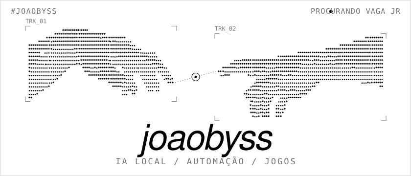
</picture></a>

<picture>
  <source media="(prefers-color-scheme: dark)" srcset="./assets/terminal-dark.svg">
  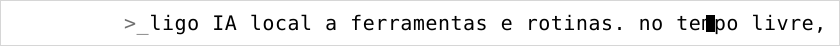
</picture>

<a href="https://exgde.github.io"><picture><source media="(prefers-color-scheme: dark)" srcset="./assets/btn-portfolio-dark.svg">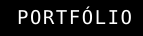</picture></a>&nbsp;
<a href="https://www.linkedin.com/in/joao-bernardes-478749415/"><picture><source media="(prefers-color-scheme: dark)" srcset="./assets/btn-linkedin-dark.svg">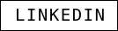</picture></a>&nbsp;
<a href="mailto:jbmidiasxboy@gmail.com"><picture><source media="(prefers-color-scheme: dark)" srcset="./assets/btn-email-dark.svg">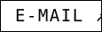</picture></a>&nbsp;
<a href="https://joaobyss.itch.io"><picture><source media="(prefers-color-scheme: dark)" srcset="./assets/btn-itch-dark.svg">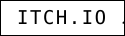</picture></a>

 

<picture>
  <source media="(prefers-color-scheme: dark)" srcset="./assets/sec-sobre-dark.svg">
  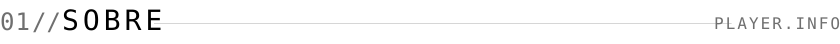
</picture>

<picture>
  <source media="(prefers-color-scheme: dark)" srcset="./assets/sobre-dark.svg">
  
</picture>

  

<picture>
  <source media="(prefers-color-scheme: dark)" srcset="./assets/sec-stack-dark.svg">
  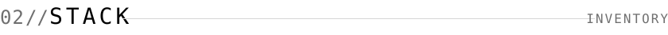
</picture>

<picture>
  <source media="(prefers-color-scheme: dark)" srcset="./assets/icones-dark.svg">
  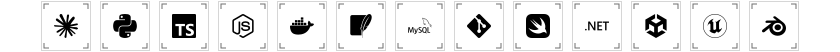
</picture>

  

<picture>
  <source media="(prefers-color-scheme: dark)" srcset="./assets/tags-dark.svg">
  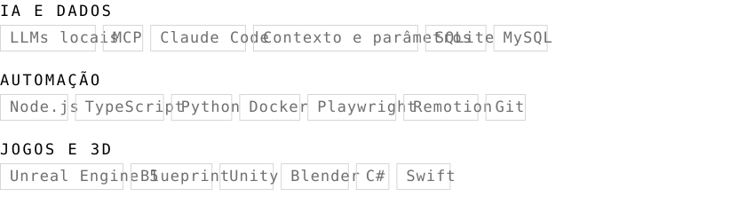
</picture>

  

<picture>
  <source media="(prefers-color-scheme: dark)" srcset="./assets/sec-abertos-dark.svg">
  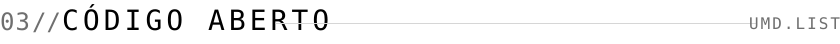
</picture>

<a href="https://github.com/exgde/oot-switch2-button-prompts">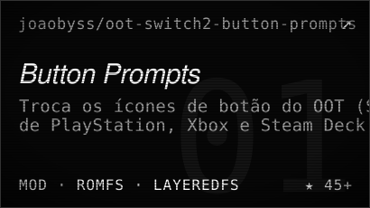</a>
<a href="https://github.com/exgde/oot-lichii-keyboard-mouse">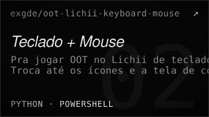</a>

<a href="https://github.com/exgde/exgde.github.io">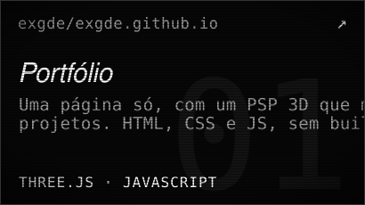</a>
<a href="https://github.com/exgde/adega">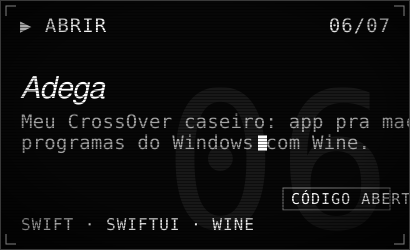</a>

<a href="https://github.com/exgde/biblioteca-sql">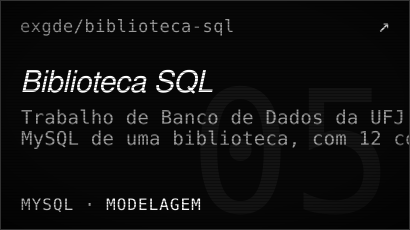</a>
<a href="https://joaobyss.itch.io/goldspotting">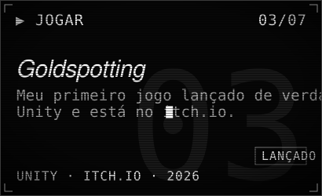</a>

 

<picture>
  <source media="(prefers-color-scheme: dark)" srcset="./assets/sec-andamento-dark.svg">
  
</picture>

<picture>
  <source media="(prefers-color-scheme: dark)" srcset="./assets/andamento-dark.svg">
  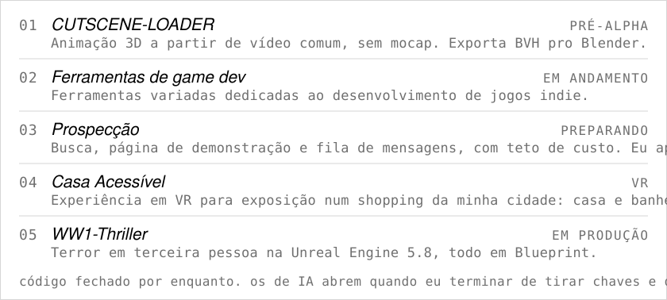
</picture>

  

<picture>
  <source media="(prefers-color-scheme: dark)" srcset="./assets/sec-contato-dark.svg">
  
</picture>

<a href="mailto:jbmidiasxboy@gmail.com"><picture>
  <source media="(prefers-color-scheme: dark)" srcset="./assets/contato-dark.svg">
  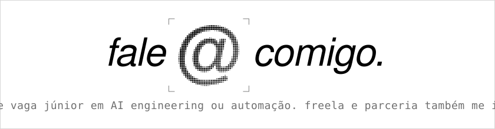
</picture></a>

  

<picture>
  <source media="(prefers-color-scheme: dark)" srcset="./assets/rodape-dark.svg">
  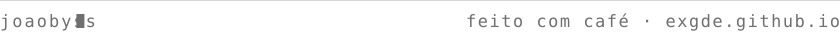
</picture>
